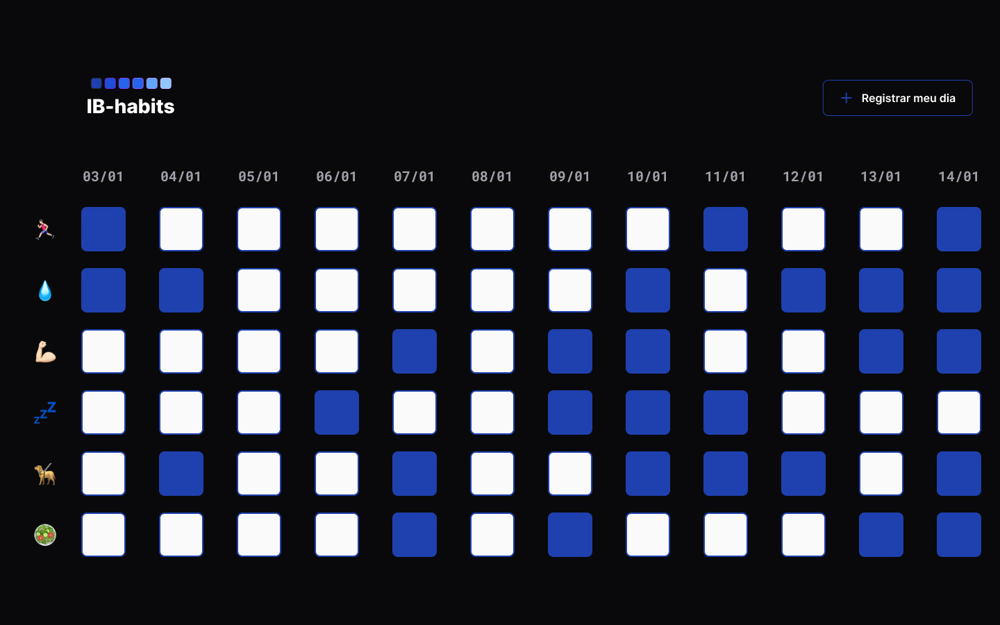

<h1 align="center"> IB-Habits </h1>

  

## 🚀 Tecnologias

Esse projeto foi desenvolvido com as seguintes tecnologias:

- HTML e CSS
- JavaScript
- Git e Github
- Figma

## 💻 Projeto

O IB-Habits é um app para ajudar a rastrear os hábitos personalizados.

- [Visite o projeto online](https://israelbernardo22.github.io/IB-habits/)

## 🔖 Layout

Você pode visualizar o layout do projeto através [DESSE LINK](https://www.figma.com/file/BZ6GpqMRdti1QZmVtjXHwj/Habits-(e)-(Community)?node-id=75%3A1108&t=edBglEInCWDfwiKE-4). É necessário ter conta no [Figma](https://figma.com) para acessá-lo.

 Feito com ♥ by Israel Bernardo